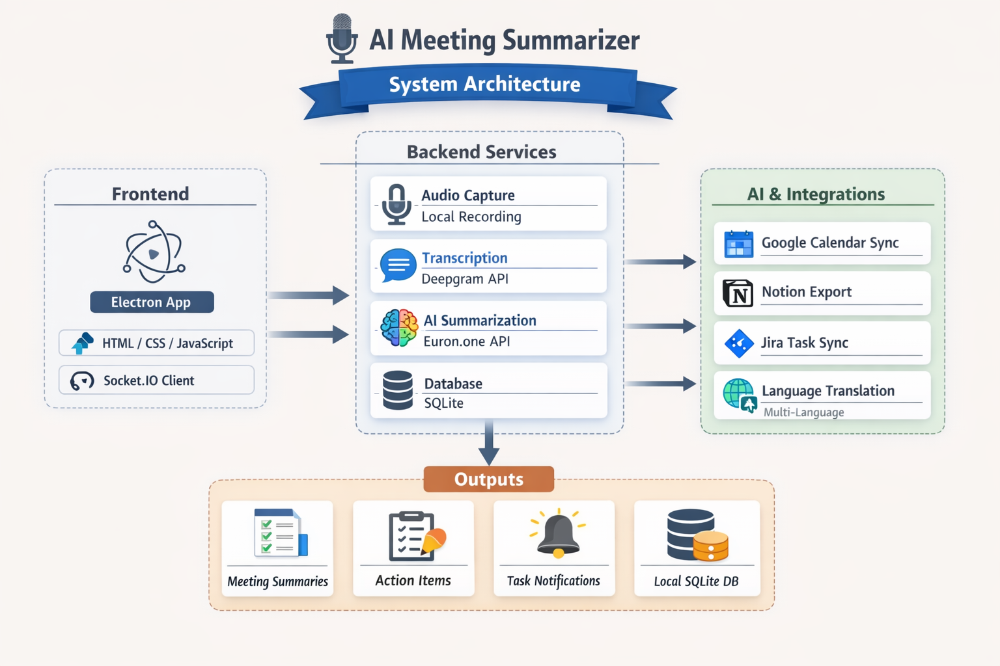

# 🎤 AI Meeting Summarizer

> A powerful desktop application that records, transcribes, summarizes, and generates actionable items from meetings using advanced AI technology.


---

## 🏗️ System Architecture

<p align="center">
  <a href="docs/system-architecture.png">
    
  </a>
</p>

---

## ✨ Features

### Core Capabilities
- 🎙️ **Local Audio Capture** - Record meetings directly from your microphone
- ⚡ **Real-Time Transcription** - See transcription appear every 10 seconds while recording
- 🤖 **AI-Powered Summarization** - Get detailed, comprehensive meeting summaries
- 📋 **Action Item Extraction** - Automatically identify tasks, assignments, and deadlines
- 🎯 **Smart Task Lists** - Auto-generated task lists with priorities and assignees
- 🔔 **Desktop Notifications** - Real-time notifications for all major events

### Integrations
- 📅 **Google Calendar Sync** - Export action items as calendar events
- 📝 **Notion Export** - Send meeting notes to Notion pages
- 🎯 **Jira Task Sync** - Create Jira tasks from action items
- 🌐 **Language Translation** - Translate meetings to 12+ languages

### Additional Features
- ✏️ **Meeting Title Editing** - Edit and customize meeting titles
- 🎵 **Audio Playback** - Listen to recorded audio from meeting details
- 🔍 **Advanced Search & Filters** - Find meetings by date, title, or action item status
- 👥 **Participant Tracking** - Track meeting attendees
- 💾 **Local Storage** - All data stored locally in SQLite database

---

## 🎬 Demo

<!-- Add screenshots here -->
```
screenshots/
├── main-view.png
├── recording-view.png
├── live-transcription.png
└── meeting-details.png
```

---

## 🛠️ Tech Stack

### Desktop Framework
- **Electron** - Cross-platform desktop application

### Backend
- **Python 3.8+** - Core backend runtime
- **Flask** - Web framework
- **Flask-SocketIO** - Real-time communication
- **SQLAlchemy** - Database ORM
- **SQLite** - Local database

### AI Services
- **Deepgram API** - Speech-to-text transcription
- **Euron.one API** - GPT-4.1 mini for summarization and action item extraction
- **Deep Translator** - Multi-language translation

### Frontend
- **HTML/CSS/JavaScript** - UI implementation
- **Axios** - HTTP client
- **Socket.IO Client** - Real-time updates

---

## 📦 Installation

### Prerequisites
- **Python 3.8+**
- **Node.js 18+**
- **Git**

### Step 1: Clone Repository
```bash
git clone https://github.com/yourusername/ai-meeting-summarizer.git
cd ai-meeting-summarizer
```

### Step 2: Install Python Dependencies
```bash
# Create virtual environment
python -m venv venv

# Activate virtual environment
# Windows:
venv\Scripts\activate
# macOS/Linux:
source venv/bin/activate

# Install dependencies
pip install -r requirements.txt
```

### Step 3: Install Node Dependencies
```bash
npm install
```

### Step 4: Configure Environment Variables
Create a `.env` file in the root directory:

```env
# Transcription API (Required)
TRANSCRIPTION_MODEL=deepgram
DEEPGRAM_API_KEY=your_deepgram_api_key_here

# AI Summarization (Required)
USE_EURON_API=true
EURON_API_KEY=your_euron_api_key_here
EURON_API_BASE=https://api.euron.one/v1
EURON_MODEL=gpt-4.1-mini

# Optional Features
DEBUG=False
DATABASE_PATH=data/meetings.db
```

---

## 🚀 Usage

### Start the Application
```bash
npm start
```

This command will:
1. Start the Python backend on `http://127.0.0.1:5000`
2. Launch the Electron desktop app

### Recording a Meeting

1. **Click "New Meeting"** in the sidebar
2. **Enter meeting title** and participants (optional)
3. **Click "Start Recording"** 
4. **Speak naturally** - live transcription appears every 10 seconds
5. **Click "Stop Recording"** when done
6. **Wait for AI processing** (~30-60 seconds)
7. **View summary and action items**

### Managing Meetings

- **View All Meetings** - Click "Meetings" in sidebar
- **Search** - Use search bar to filter by title/content
- **Filter** - Apply date range, action item status filters
- **Open Details** - Click any meeting to view full details
- **Edit Title** - Click title, edit, and save
- **Play Audio** - Use audio player in meeting details

### Syncing Tasks

#### Google Calendar
1. Go to **Settings** → **Integrations**
2. Click **"Connect to Google"**
3. Authorize in browser
4. Open any meeting
5. Click **"📅 Sync to Google Calendar"**

#### Notion
1. Get Notion API key from [notion.so/my-integrations](https://notion.so/my-integrations)
2. Go to **Settings** → **Integrations**
3. Enter API key in **Notion** field
4. Click **"📝 Export to Notion"** from any meeting

#### Jira
1. Go to **Settings** → **Integrations** → **Jira**
2. Enter:
   - Server URL (e.g., `https://yourcompany.atlassian.net`)
   - Email
   - API Token
   - Project Key
3. Click **"Configure Jira"**
4. Click **"🎯 Sync to Jira"** from any meeting

---

## 🔑 API Keys Setup

### Deepgram API (Required)
1. Sign up at [deepgram.com](https://deepgram.com)
2. Get API key from console
3. Add to `.env` as `DEEPGRAM_API_KEY`

### Euron.one API (Required)
1. Sign up at [euron.one](https://euron.one)
2. Get API key
3. Add to `.env` as `EURON_API_KEY`

### Google Calendar (Optional)
See [GOOGLE_CALENDAR_SETUP.md](GOOGLE_CALENDAR_SETUP.md) for detailed instructions.

### Notion (Optional)
1. Go to [notion.so/my-integrations](https://notion.so/my-integrations)
2. Create new integration
3. Copy API key
4. Add to Settings in app

### Jira (Optional)
1. Go to Jira account settings
2. Create API token
3. Add credentials in Settings

---

## 📁 Project Structure

```
ai-meeting-summarizer/
├── backend/
│   ├── agents/
│   │   ├── audio_listener.py      # Audio capture + chunking
│   │   ├── transcription.py       # Deepgram transcription
│   │   ├── summarizer.py          # AI summarization
│   │   ├── action_item_extractor.py
│   │   ├── calendar_sync.py       # Google Calendar
│   │   ├── notion_export.py       # Notion integration
│   │   ├── jira_sync.py           # Jira integration
│   │   └── translation.py         # Language translation
│   ├── app.py                     # Flask backend
│   ├── config.py                  # Configuration
│   ├── database.py                # Database setup
│   └── models.py                  # SQLAlchemy models
├── electron/
│   └── main.js                    # Electron main process
├── frontend/
│   ├── index.html                 # Main UI
│   ├── app.js                     # Frontend logic
│   └── styles.css                 # Styling
├── data/
│   ├── audio/                     # Recorded audio files
│   ├── meetings.db                # SQLite database
│   └── google_credentials.json    # Google OAuth (if used)
├── .env                           # Environment variables
├── requirements.txt               # Python dependencies
├── package.json                   # Node dependencies
└── README.md                      # This file
```

---

## 🐛 Troubleshooting

### Backend Won't Start
```bash
# Make sure virtual environment is activated
venv\Scripts\activate  # Windows
source venv/bin/activate  # macOS/Linux

# Reinstall dependencies
pip install -r requirements.txt
```

### No Meetings Showing Up
- Wait 5 seconds after opening app (backend takes time to start)
- Check if `data/meetings.db` exists
- Recordings auto-load after first recording

### Live Transcription Not Working
- Check Deepgram API key in `.env`
- Verify internet connection
- Look for `[LIVE]` messages in terminal

### Google Calendar Sync Fails
- Ensure `google_credentials.json` is in `data/` folder
- Click "Connect to Google" in Settings first
- Check Google Calendar API is enabled

### Audio Playback Not Working
- Audio files stored in `data/audio/`
- Check browser console for errors
- Verify audio file exists

---

## ⚙️ Configuration

### Change Live Transcription Interval
Edit `backend/agents/audio_listener.py`:
```python
self.chunk_duration = 10  # Change to 5, 15, etc.
```

### Customize Summary Detail Level
Edit `backend/agents/summarizer.py` - modify the `_create_summary_prompt()` method.

### Change Database Location
In `.env`:
```env
DATABASE_PATH=your/custom/path/meetings.db
```

---

## 🧪 Development

### Run in Debug Mode
```bash
# Backend
python backend/app.py

# Frontend (separate terminal)
npm run start:electron
```

### View Logs
- Backend logs: Terminal running `npm start`
- Frontend logs: Electron DevTools (Ctrl+Shift+I)

---

## 📝 Features Roadmap

- [ ] Speaker diarization (identify who said what)
- [ ] Meeting templates
- [ ] Custom action item templates
- [ ] Export to PDF
- [ ] Meeting analytics dashboard
- [ ] Team collaboration features
- [ ] Cloud sync option

---

## 🤝 Contributing

Contributions are welcome! Please follow these steps:

1. Fork the repository
2. Create a feature branch (`git checkout -b feature/AmazingFeature`)
3. Commit your changes (`git commit -m 'Add AmazingFeature'`)
4. Push to branch (`git push origin feature/AmazingFeature`)
5. Open a Pull Request

---

## 📄 License

This project is licensed under the MIT License - see the [LICENSE](LICENSE) file for details.

---

## 🙏 Acknowledgments

- **Deepgram** - For excellent speech-to-text API
- **Euron.one** - For GPT-4.1 mini access
- **Electron** - For desktop framework
- **Flask** - For backend framework

---

## 📧 Support

For issues, questions, or suggestions:
- Open an issue on GitHub
- Email: your-email@example.com

---

## 🌟 Show Your Support

If this project helped you, please give it a ⭐!

---

**Made with ❤️ by Sharayu Borkar**
